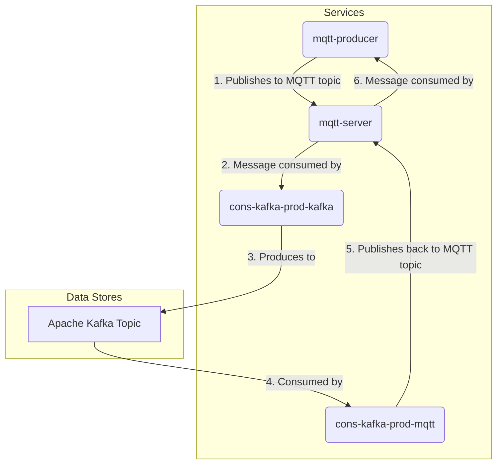

```mermaid
graph TD
    subgraph Services
        A(mqtt-producer)
        B(mqtt-server)
        C(cons-kafka-prod-kafka)
        D(cons-kafka-prod-mqtt)
    end

    subgraph Data Stores
        E[Apache Kafka Topic]
    end

    A -- 1. Publishes to MQTT topic --> B;
    B -- 2. Message consumed by --> C;
    C -- 3. Produces to --> E;
    E -- 4. Consumed by --> D;
    D -- 5. Publishes back to MQTT topic --> B;
    B -- 6. Message consumed by --> A;
```